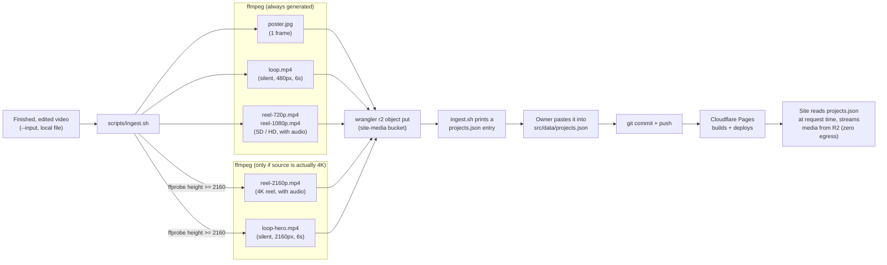
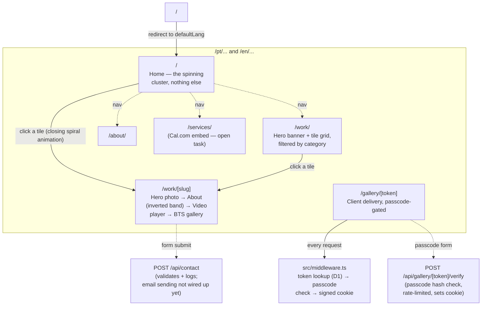

# The Drone Ninja

Bilingual (PT/EN) aerial-cinematography portfolio site for the
`@the.drone.ninja` Instagram account, built as an Astro 5 SSR app deployed to
Cloudflare Pages. See [CLAUDE.md](CLAUDE.md) for the full set of hard
constraints, deliberate design decisions, and open tasks — this file is a
map of the codebase; that one is the rulebook.

## Stack

- **[Astro 5](https://astro.build)**, `output: 'server'`, deployed via
  `@astrojs/cloudflare` — every page is server-rendered per request, not
  statically pre-built.
- **Cloudflare Pages** for hosting, **D1** (SQLite) for gallery auth data,
  **R2** for media (progressive MP4, zero egress fees — the reason this site
  can run on free tiers at all).
- **No client-side framework.** Interactivity is hand-rolled `<script>` tags
  per component/page, plus `gsap` and `lenis` for the header's animation and
  the home page's spiral. No React/Vue/Svelte.
- **`astro-icon`** resolves icons to inline SVG at request time — no runtime
  icon library shipped to the client.

## Getting started

```bash
npm install
npm run dev
```

`astro dev` runs through `platformProxy` (Miniflare), so local dev gets the
same D1/R2 binding shapes as production — see `wrangler.toml` for the
binding names and `.dev.vars` (gitignored) for local secrets. You'll need a
`GALLERY_HMAC_SECRET` in `.dev.vars` for the gallery auth flow to work
locally; in production it's set via `wrangler pages secret put`.

## Scripts

| Command | Does |
|---|---|
| `npm run dev` | Local dev server (`astro dev`) |
| `npm run build` | Production build to `./dist` |
| `npm run preview` | Serve the built output through `wrangler pages dev`, closer to real Cloudflare behavior than `astro dev` |
| `npm run deploy` | `wrangler pages deploy ./dist` |
| `npm run db:migrate` | Apply `schema.sql` to the `site-db` D1 database |
| `npm run typecheck` | `astro check` |
| `npm run check:i18n` | Fails if `src/i18n/ui.ts`'s `pt`/`en` key sets don't match exactly |

## Project structure

```
src/
  components/   Hero.astro, ProjectTile.astro — see components/README.md
  data/         site.ts (brand/operator config) + projects.json (the content) — see data/README.md
  i18n/         pt/en translation dictionary + lookup helpers — see i18n/README.md
  layouts/      BaseLayout.astro — header, nav, footer, shared page shell — see layouts/README.md
  lib/          projects.ts, cluster-layout.ts, motion-prefs.ts, gallery-auth.ts — see lib/README.md
  pages/        file-based routes, [lang]-prefixed — see pages/README.md
  styles/       global.css — fonts, color tokens, reduced-motion override
  middleware.ts gallery token/passcode/cookie gate, runs before every /[lang]/gallery/[token] request
  env.d.ts      Cloudflare runtime env typing (D1/R2 bindings, secrets)
scripts/        ingest.sh (the CMS) + check-i18n.ts — see scripts/README.md
schema.sql      D1 schema for gallery auth (galleries + gallery_media tables)
public/         static files served as-is (fonts, logo, media-placeholder for local dev)
```

Each subdirectory above with a linked README explains its own files in more
depth — start there once you're editing something specific.

## Content: there is no CMS

New work goes up by running `scripts/ingest.sh` against a finished,
already-edited video, then pasting its printed JSON output into
`src/data/projects.json` and committing. That's the entire publishing
pipeline — see [scripts/README.md](scripts/README.md).



Nothing here runs automatically — every arrow from the video file to the
committed JSON entry is a manual step the owner takes. There's no upload
form, no admin panel, no webhook.

## i18n

Every user-facing string lives in `src/i18n/ui.ts` under both a `pt` and an
`en` key. A key present in only one locale is a bug — `npm run check:i18n`
enforces this in CI/pre-commit. See [i18n/README.md](i18n/README.md).

## Routing

Every real page lives under `/[lang]/...` (`pt` or `en`), resolved via
`src/i18n/utils.ts`. `/pt/` is Home, `/pt/work/` lists projects,
`/pt/work/[slug]` is a project detail page, `/pt/about/` and `/pt/services/`
are their own routes, and `/pt/gallery/[token]` is the client-delivery
gallery (token + optional passcode, gated by `src/middleware.ts`). Full
breakdown in [pages/README.md](pages/README.md).



Home is deliberately just the cluster — the practical browsing experience
(headline, category filters, the plain grid) lives on `/work/`, not Home.

## Deploying

This is a from-scratch Cloudflare project — the D1 database and R2 bucket
referenced in `wrangler.toml` don't exist yet until you create them (see
CLAUDE.md's "Open tasks" for the exact `wrangler d1 create` / `wrangler r2
bucket create` commands and what to do with their output). Real secrets
(`GALLERY_HMAC_SECRET`) are set with `wrangler pages secret put`, never
committed.
